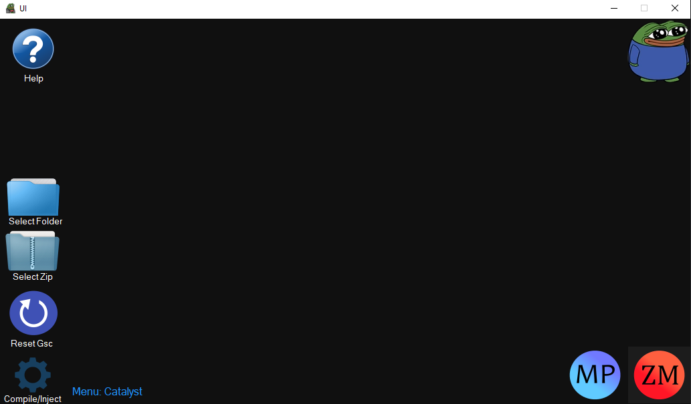

# T7-Compiler-UI
Ui for serious' compiler

# Requirements
This project requires you to have .net framework 4.8 installed
> Download: https://go.microsoft.com/fwlink/?LinkId=2085155 

# Info
Usage 

*Regular Usage*
Select Folder->Locate the folder youd like
Insure the folder contains a "scripts" folder
Select your gamemode
Hit compile/inject

*ZIPS*
* Zip files must be structured like this, or they will **not** work.
* Zip->FolderName->scripts folder
* Zip->FolderName->gsc.conf
* The zip file should contain a folder inside of the zip file contaning a scripts folder with your menus code inside of the scripts folder, it must also containt a gsc.conf for the gamemode reading to work, if for any reason you do not have a gsc.conf it will create one for you if you use the gamemode selector.

# More Info?

Compiler by https://github.com/shiversoftdev 

Compiler Link https://github.com/shiversoftdev/t7-compiler
